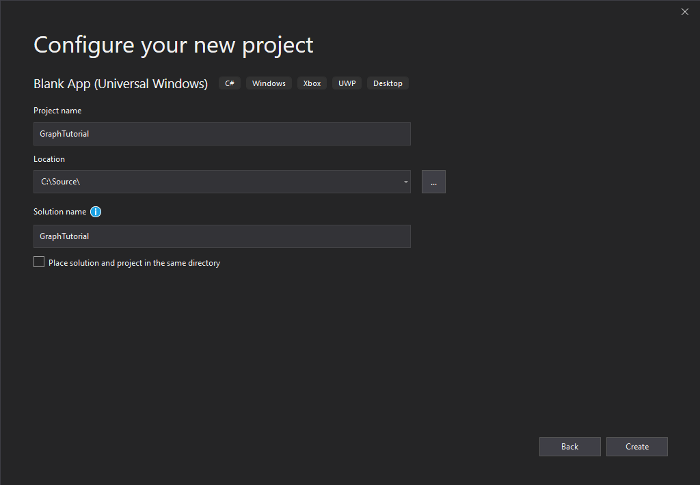
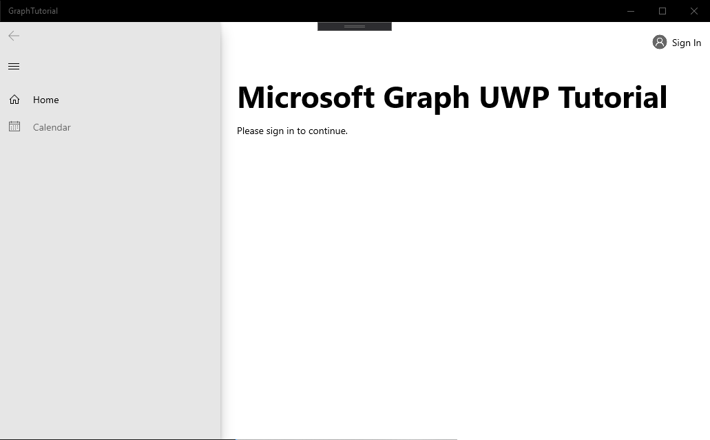

<!-- markdownlint-disable MD002 MD041 -->

Ouvrez Visual Studio, puis sélectionnez **créer un nouveau projet**. Choisissez l’option **application vierge (Windows universel)** qui utilise C#, puis sélectionnez **suivant**.


Dans la boîte de dialogue **configurer votre nouveau projet** , entrez `graph-tutorial` dans le champ **nom du projet** et sélectionnez **créer**.



> [!IMPORTANT]
> Assurez-vous d’entrer exactement le même nom pour le projet Visual Studio spécifié dans ces instructions d’atelier. Le nom du projet Visual Studio devient partie intégrante de l’espace de noms dans le code. Le code à l’intérieur de ces instructions dépend de l’espace de noms correspondant au nom de projet Visual Studio spécifié dans ces instructions. Si vous utilisez un nom de projet différent, le code n’est pas compilé, sauf si vous ajustez tous les espaces de noms pour qu’ils correspondent au nom de projet Visual Studio que vous entrez lors de la création du projet.

Sélectionnez **OK**. Dans la boîte de dialogue **nouveau projet de plateforme Windows universelle** , vérifiez que la **version minimale** est définie sur `Windows 10 Fall Creators Update (10.0; Build 16299)` ou version ultérieure, puis sélectionnez **OK**.

Avant de poursuivre, installez des packages NuGet supplémentaires que vous utiliserez plus tard.

- [Microsoft. Toolkit. UWP. UI. Controls](https://www.nuget.org/packages/Microsoft.Toolkit.Uwp.Ui.Controls/) pour ajouter des contrôles d’interface utilisateur pour les notifications et les indicateurs de chargement dans l’application.
- [Microsoft. Toolkit. UWP. UI. Controls. DataGrid](https://www.nuget.org/packages/Microsoft.Toolkit.Uwp.Ui.Controls.DataGrid/) pour afficher les informations renvoyées par Microsoft Graph.
- [Microsoft. Toolkit. UWP. UI. Controls. Graph](https://www.nuget.org/packages/Microsoft.Toolkit.Uwp.Ui.Controls.Graph/) pour gérer l’extraction des jetons d’accès et de connexion.
- [Microsoft. Graph](https://www.nuget.org/packages/Microsoft.Graph/) pour effectuer des appels à Microsoft Graph.

Sélectionnez **outils > gestionnaire de package NuGet > console Gestionnaire de package**. Dans la console Gestionnaire de package, entrez les commandes suivantes.

```Powershell
Install-Package Microsoft.Toolkit.Uwp.Ui.Controls -Version 6.0.0
Install-Package Microsoft.Toolkit.Uwp.Ui.Controls.DataGrid -Version 6.0.0
Install-Package Microsoft.Toolkit.Uwp.Ui.Controls.Graph -Version 6.0.0
Install-Package Microsoft.Graph -Version 1.20.0
```

## <a name="design-the-app"></a>Concevoir l’application

Commencez par ajouter une variable au niveau de l’application pour effectuer le suivi de l’état d’authentification. Dans l’Explorateur de solutions, développez **app. Xaml** et ouvrez **app.Xaml.cs**. Ajoutez la propriété suivante à la `App` classe.

```cs
public bool IsAuthenticated { get; set; }
```

Définissez ensuite la disposition de la page principale. Ouvrez `MainPage.xaml` et remplacez l’intégralité de son contenu par ce qui suit.

```xml
<Page
    x:Class="graph_tutorial.MainPage"
    xmlns="http://schemas.microsoft.com/winfx/2006/xaml/presentation"
    xmlns:x="http://schemas.microsoft.com/winfx/2006/xaml"
    xmlns:local="using:graph_tutorial"
    xmlns:d="http://schemas.microsoft.com/expression/blend/2008"
    xmlns:mc="http://schemas.openxmlformats.org/markup-compatibility/2006"
    xmlns:controls="using:Microsoft.Toolkit.Uwp.UI.Controls"
    xmlns:graphControls="using:Microsoft.Toolkit.Uwp.UI.Controls.Graph"
    mc:Ignorable="d"
    Background="{ThemeResource ApplicationPageBackgroundThemeBrush}">

    <Grid>
        <NavigationView x:Name="NavView"
            IsSettingsVisible="False"
            ItemInvoked="NavView_ItemInvoked">

            <NavigationView.Header>
                <graphControls:AadLogin x:Name="Login"
                    HorizontalAlignment="Left"
                    View="SmallProfilePhotoLeft"
                    AllowSignInAsDifferentUser="False"
                    />
            </NavigationView.Header>

            <NavigationView.MenuItems>
                <NavigationViewItem Content="Home" x:Name="Home" Tag="home">
                    <NavigationViewItem.Icon>
                        <FontIcon Glyph="&#xE10F;"/>
                    </NavigationViewItem.Icon>
                </NavigationViewItem>
                <NavigationViewItem Content="Calendar" x:Name="Calendar" Tag="calendar">
                    <NavigationViewItem.Icon>
                        <FontIcon Glyph="&#xE163;"/>
                    </NavigationViewItem.Icon>
                </NavigationViewItem>
            </NavigationView.MenuItems>

            <StackPanel>
                <controls:InAppNotification x:Name="Notification" ShowDismissButton="true" />
                <Frame x:Name="RootFrame" Margin="24, 0" />
            </StackPanel>
        </NavigationView>
    </Grid>
</Page>
```

Cela définit un [NavigationView](https://docs.microsoft.com/uwp/api/windows.ui.xaml.controls.navigationview) de base avec des liens de navigation **Accueil** et **calendrier** pour agir en tant que vue principale de l’application. Il ajoute également un contrôle [AadLogin](https://docs.microsoft.com/dotnet/api/microsoft.toolkit.uwp.ui.controls.graph.aadlogin?view=win-comm-toolkit-dotnet-stable) dans l’en-tête de la vue. Ce contrôle permettra à l’utilisateur de se connecter et de se déconnecter. Le contrôle n’est pas encore entièrement activé, vous le configurerez dans un exercice ultérieur.

Maintenant, ajoutez une autre page XAML pour le mode Accueil. Cliquez avec le bouton droit sur le projet du **didacticiel Graph** dans l’Explorateur de solutions et sélectionnez **Ajouter > nouvel élément...**. Choisissez **page vierge**, entrez `HomePage.xaml` dans le champ **nom** , puis sélectionnez **Ajouter**. Ajoutez le code suivant à l' `<Grid>` intérieur de l’élément dans le fichier.

```xml
<StackPanel>
    <TextBlock FontSize="44" FontWeight="Bold" Margin="0, 12">Microsoft Graph UWP Tutorial</TextBlock>
    <TextBlock x:Name="HomePageMessage">Please sign in to continue.</TextBlock>
</StackPanel>
```

Maintenant, développez **MainPage. Xaml** dans l’Explorateur `MainPage.xaml.cs`de solutions et ouvrez. Ajoutez la fonction suivante à la `MainPage` classe pour gérer l’état de l’authentification.

```cs
private void SetAuthState(bool isAuthenticated)
{
    (App.Current as App).IsAuthenticated = isAuthenticated;

    // Toggle controls that require auth
    Calendar.IsEnabled = isAuthenticated;
}
```

Ajoutez le code suivant au `MainPage()` constructeur **après** la `this.InitializeComponent();` ligne.

```cs
// Initialize auth state to false
SetAuthState(false);

// Navigate to HomePage.xaml
RootFrame.Navigate(typeof(HomePage));
```

Lorsque l’application démarre pour la première fois, elle Initialise l’état d' `false` authentification et accède à la page d’accueil.

Ajoutez le gestionnaire d’événements suivant pour charger la page demandée lorsque l’utilisateur sélectionne un élément dans l’affichage de navigation.

```cs
private void NavView_ItemInvoked(NavigationView sender, NavigationViewItemInvokedEventArgs args)
{
    var invokedItem = args.InvokedItem as string;

    switch (invokedItem.ToLower())
    {
        case "calendar":
            throw new NotImplementedException();
            break;
        case "home":
        default:
            RootFrame.Navigate(typeof(HomePage));
            break;
    }
}
```

Enregistrez toutes vos modifications, appuyez sur **F5** ou sélectionnez **débogage > démarrer le débogage** dans Visual Studio.

> [!NOTE]
> Assurez-vous que vous sélectionnez la configuration appropriée pour votre ordinateur (ARM, x64, x86).


