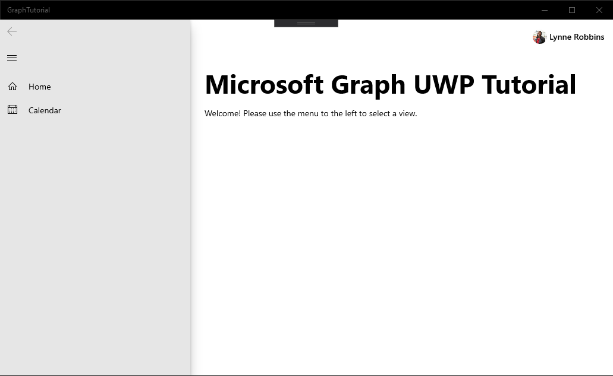

<!-- markdownlint-disable MD002 MD041 -->

Dans cet exercice, vous allez étendre l’application de l’exercice précédent pour prendre en charge l’authentification avec Azure AD. Cela est nécessaire pour obtenir le jeton d’accès OAuth nécessaire pour appeler Microsoft Graph. Dans cette étape, vous allez intégrer le contrôle **LoginButton** des [contrôles Windows Graph](https://github.com/windows-toolkit/Graph-Controls) dans l’application.

1. Cliquez avec le bouton droit sur le projet **GraphTutorial** dans l’Explorateur de solutions et sélectionnez **Ajouter > nouvel élément...**. Sélectionnez le **fichier de ressources (. resw)**, nommez le fichier `OAuth.resw` , puis sélectionnez **Ajouter**. Lorsque le nouveau fichier s’ouvre dans Visual Studio, créez deux ressources comme suit.

    - **Name :** `AppId`, **value :** l’ID d’application que vous avez généré dans le portail d’inscription d’application
    - **Nom :** `Scopes`, **valeur :**`User.Read Calendars.Read`

    

    > [!IMPORTANT]
    > Si vous utilisez le contrôle de code source tel que git, il est maintenant recommandé d’exclure le `OAuth.resw` fichier du contrôle de code source afin d’éviter une fuite accidentelle de votre ID d’application.

## <a name="configure-the-loginbutton-control"></a>Configurer le contrôle LoginButton

1. Ouvrez `MainPage.xaml.cs` et ajoutez l’instruction `using` suivante en haut du fichier.

    ```csharp
    using Microsoft.Toolkit.Graph.Providers;
    ```

1. Remplacez le constructeur existant par ce qui suit.

    :::code language="csharp" source="../demo/GraphTutorial/MainPage.xaml.cs" id="ConstructorSnippet":::

    Ce code charge les paramètres à `OAuth.resw` partir de et initialise le fournisseur MSAL avec ces valeurs.

1. À présent, ajoutez un gestionnaire d' `ProviderUpdated` événements pour l' `ProviderManager`événement sur le. Ajoutez la fonction suivante à la classe `MainPage`.

    :::code language="csharp" source="../demo/GraphTutorial/MainPage.xaml.cs" id="ProviderUpdatedSnippet":::

    Cet événement se déclenche lorsque le fournisseur change ou lorsque l’état du fournisseur change.

1. Dans l’Explorateur de solutions, développez **homepage. Xaml** et ouvrez `HomePage.xaml.cs`. Remplacez le constructeur existant par ce qui suit.

    :::code language="csharp" source="../demo/GraphTutorial/HomePage.xaml.cs" id="ConstructorSnippet":::

1. Redémarrez l’application et cliquez sur le contrôle **de connexion** en haut de l’application. Une fois que vous êtes connecté, l’interface utilisateur doit changer pour indiquer que vous avez réussi à vous connecter.

    

    > [!NOTE]
    > Le `ButtonLogin` contrôle implémente la logique de stockage et d’actualisation du jeton d’accès pour vous. Les jetons sont stockés dans un emplacement de stockage sécurisé et actualisés en fonction des besoins.
