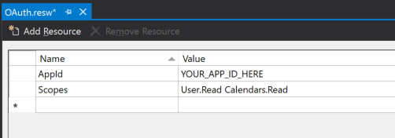

<!-- markdownlint-disable MD002 MD041 -->

<span data-ttu-id="ecaf4-101">Dans cet exercice, vous allez étendre l’application de l’exercice précédent pour prendre en charge l’authentification avec Azure AD.</span><span class="sxs-lookup"><span data-stu-id="ecaf4-101">In this exercise you will extend the application from the previous exercise to support authentication with Azure AD.</span></span> <span data-ttu-id="ecaf4-102">Cela est nécessaire pour obtenir le jeton d’accès OAuth nécessaire pour appeler Microsoft Graph.</span><span class="sxs-lookup"><span data-stu-id="ecaf4-102">This is required to obtain the necessary OAuth access token to call the Microsoft Graph.</span></span> <span data-ttu-id="ecaf4-103">Dans cette étape, vous allez intégrer le contrôle [AadLogin](https://docs.microsoft.com/dotnet/api/microsoft.toolkit.uwp.ui.controls.graph.aadlogin?view=win-comm-toolkit-dotnet-stable) de la boîte à outils de la [communauté Windows](https://github.com/Microsoft/WindowsCommunityToolkit) dans l’application.</span><span class="sxs-lookup"><span data-stu-id="ecaf4-103">In this step you will integrate the [AadLogin](https://docs.microsoft.com/dotnet/api/microsoft.toolkit.uwp.ui.controls.graph.aadlogin?view=win-comm-toolkit-dotnet-stable) control from the [Windows Community Toolkit](https://github.com/Microsoft/WindowsCommunityToolkit) into the application.</span></span>

<span data-ttu-id="ecaf4-104">Cliquez avec le bouton droit sur le projet du **didacticiel Graph** dans l’Explorateur de solutions et sélectionnez **Ajouter > nouvel élément...**. Sélectionnez le **fichier de ressources (. resw)**, nommez le fichier `OAuth.resw` , puis sélectionnez **Ajouter**.</span><span class="sxs-lookup"><span data-stu-id="ecaf4-104">Right-click the **graph-tutorial** project in Solution Explorer and select **Add > New Item...**. Choose **Resources File (.resw)**, name the file `OAuth.resw` and select **Add**.</span></span> <span data-ttu-id="ecaf4-105">Lorsque le nouveau fichier s’ouvre dans Visual Studio, créez deux ressources comme suit.</span><span class="sxs-lookup"><span data-stu-id="ecaf4-105">When the new file opens in Visual Studio, create two resources as follows.</span></span>

- <span data-ttu-id="ecaf4-106">**Nom:** `AppId` **Valeur:** ID de l’application que vous avez généré dans le portail d’inscription des applications</span><span class="sxs-lookup"><span data-stu-id="ecaf4-106">**Name:** `AppId`, **Value:** the app ID you generated in Application Registration Portal</span></span>
- <span data-ttu-id="ecaf4-107">**Nom:** `Scopes` **Valeur:**`User.Read Calendars.Read`</span><span class="sxs-lookup"><span data-stu-id="ecaf4-107">**Name:** `Scopes`, **Value:** `User.Read Calendars.Read`</span></span>



> [!IMPORTANT]
> <span data-ttu-id="ecaf4-109">Si vous utilisez le contrôle de code source tel que git, il est maintenant recommandé d’exclure le `OAuth.resw` fichier du contrôle de code source afin d’éviter une fuite accidentelle de votre ID d’application.</span><span class="sxs-lookup"><span data-stu-id="ecaf4-109">If you're using source control such as git, now would be a good time to exclude the `OAuth.resw` file from source control to avoid inadvertently leaking your app ID.</span></span>

## <a name="configure-the-aadlogin-control"></a><span data-ttu-id="ecaf4-110">Configurer le contrôle AadLogin</span><span class="sxs-lookup"><span data-stu-id="ecaf4-110">Configure the AadLogin control</span></span>

<span data-ttu-id="ecaf4-111">Commencez par ajouter du code pour lire les valeurs du fichier de ressources.</span><span class="sxs-lookup"><span data-stu-id="ecaf4-111">Start by adding code to read the values out of the resources file.</span></span> <span data-ttu-id="ecaf4-112">Ouvrez `MainPage.xaml.cs` et ajoutez l’instruction `using` suivante en haut du fichier.</span><span class="sxs-lookup"><span data-stu-id="ecaf4-112">Open `MainPage.xaml.cs` and add the following `using` statement to the top of the file.</span></span>

```cs
using Microsoft.Toolkit.Services.MicrosoftGraph;
```

<span data-ttu-id="ecaf4-113">Remplacez la ligne `RootFrame.Navigate(typeof(HomePage));` par le code suivant.</span><span class="sxs-lookup"><span data-stu-id="ecaf4-113">Replace the `RootFrame.Navigate(typeof(HomePage));` line with the following code.</span></span>

```cs
// Load OAuth settings
var oauthSettings = Windows.ApplicationModel.Resources.ResourceLoader.GetForCurrentView("OAuth");
var appId = oauthSettings.GetString("AppId");
var scopes = oauthSettings.GetString("Scopes");

if (string.IsNullOrEmpty(appId) || string.IsNullOrEmpty(scopes))
{
    Notification.Show("Could not load OAuth Settings from resource file.");
}
else
{
    // Initialize Graph
    MicrosoftGraphService.Instance.AuthenticationModel = MicrosoftGraphEnums.AuthenticationModel.V2;
    MicrosoftGraphService.Instance.Initialize(appId,
        MicrosoftGraphEnums.ServicesToInitialize.UserProfile,
        scopes.Split(' '));

    // Navigate to HomePage.xaml
    RootFrame.Navigate(typeof(HomePage));
}
```

<span data-ttu-id="ecaf4-114">Ce code charge les paramètres à `OAuth.resw` partir de et initialise l’instance globale de `MicrosoftGraphService` à l’aide de ces valeurs.</span><span class="sxs-lookup"><span data-stu-id="ecaf4-114">This code loads the settings from `OAuth.resw` and initializes the global instance of the `MicrosoftGraphService` with those values.</span></span>

<span data-ttu-id="ecaf4-115">À présent, ajoutez un gestionnaire d' `SignInCompleted` événements pour l' `AadLogin` événement sur le contrôle.</span><span class="sxs-lookup"><span data-stu-id="ecaf4-115">Now add an event handler for the `SignInCompleted` event on the `AadLogin` control.</span></span> <span data-ttu-id="ecaf4-116">Ouvrez le `MainPage.xaml` fichier et remplacez l’élément `<graphControls:AadLogin>` existant par ce qui suit.</span><span class="sxs-lookup"><span data-stu-id="ecaf4-116">Open the `MainPage.xaml` file and replace the existing `<graphControls:AadLogin>` element with the following.</span></span>

```xml
<graphControls:AadLogin x:Name="Login"
    HorizontalAlignment="Left"
    View="SmallProfilePhotoLeft"
    AllowSignInAsDifferentUser="False"
    SignInCompleted="Login_SignInCompleted"
    SignOutCompleted="Login_SignOutCompleted"
    />
```

<span data-ttu-id="ecaf4-117">Ajoutez ensuite les fonctions suivantes à la `MainPage` classe dans `MainPage.xaml.cs`.</span><span class="sxs-lookup"><span data-stu-id="ecaf4-117">Then add the following functions to the `MainPage` class in `MainPage.xaml.cs`.</span></span>

```cs
private void Login_SignInCompleted(object sender, Microsoft.Toolkit.Uwp.UI.Controls.Graph.SignInEventArgs e)
{
    // Set the auth state
    SetAuthState(true);
    // Reload the home page
    RootFrame.Navigate(typeof(HomePage));
}

private void Login_SignOutCompleted(object sender, EventArgs e)
{
    // Set the auth state
    SetAuthState(false);
    // Reload the home page
    RootFrame.Navigate(typeof(HomePage));
}
```

<span data-ttu-id="ecaf4-118">Enfin, dans l’Explorateur de solutions, développez **homepage. Xaml** et ouvrez `HomePage.xaml.cs`.</span><span class="sxs-lookup"><span data-stu-id="ecaf4-118">Finally, in Solution Explorer, expand **HomePage.xaml** and open `HomePage.xaml.cs`.</span></span> <span data-ttu-id="ecaf4-119">Ajoutez le code suivant après la `this.InitializeComponent();` ligne.</span><span class="sxs-lookup"><span data-stu-id="ecaf4-119">Add the following code after the `this.InitializeComponent();` line.</span></span>

```cs
if ((App.Current as App).IsAuthenticated)
{
    HomePageMessage.Text = "Welcome! Please use the menu to the left to select a view.";
}
```

<span data-ttu-id="ecaf4-120">Redémarrez l’application et cliquez sur le contrôle **de connexion** en haut de l’application.</span><span class="sxs-lookup"><span data-stu-id="ecaf4-120">Restart the app and click the **Sign In** control at the top of the app.</span></span> <span data-ttu-id="ecaf4-121">Une fois que vous êtes connecté, l’interface utilisateur doit changer pour indiquer que vous avez réussi à vous connecter.</span><span class="sxs-lookup"><span data-stu-id="ecaf4-121">Once you've signed in, the UI should change to indicate that you've successfully signed-in.</span></span>


> [!NOTE]
> <span data-ttu-id="ecaf4-123">Le `AadLogin` contrôle implémente la logique de stockage et d’actualisation du jeton d’accès pour vous.</span><span class="sxs-lookup"><span data-stu-id="ecaf4-123">The `AadLogin` control implements the logic of storing and refreshing the access token for you.</span></span> <span data-ttu-id="ecaf4-124">Les jetons sont stockés dans un emplacement de stockage sécurisé et actualisés en fonction des besoins.</span><span class="sxs-lookup"><span data-stu-id="ecaf4-124">The tokens are stored in secure storage and refreshed as needed.</span></span>
