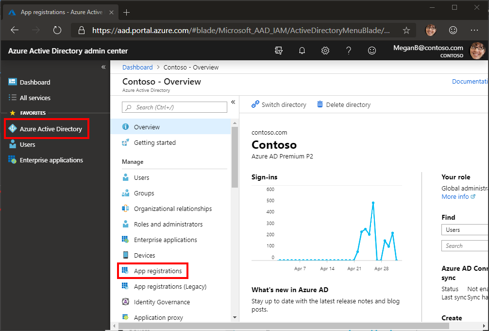
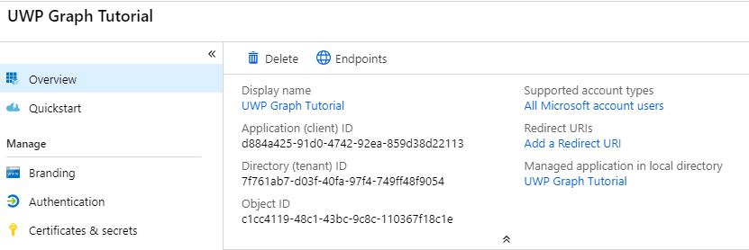

<!-- markdownlint-disable MD002 MD041 -->

Dans cet exercice, vous allez créer une application native Azure AD à l'aide du centre d'administration Azure Active Directory.

1. Ouvrez un navigateur et accédez au [Centre d'administration Azure Active Directory](https://aad.portal.azure.com) et ouvrez une session à l'aide d'un compte **personnel** (alias Microsoft) ou d'un **compte professionnel ou scolaire**.

1. Sélectionnez **Azure Active Directory** dans le volet de navigation de gauche, puis sélectionnez **inscriptions des applications (aperçu)** sous **gérer**.

    

1. Sélectionnez **nouvelle inscription**. Sur la page **inscrire une application** , définissez les valeurs comme suit.

    - Définissez **nom** sur `UWP Graph Tutorial`.
    - Définissez les types de comptes **pris en charge** sur **les comptes de tous les comptes d'annuaire et de Microsoft personnels**.
    - Laissez l' **URI** de redirection vide.

    

1. Sélectionnez **Enregistrer**. Sur la page **didacticiel Graph UWP** , copiez la valeur de l' **ID d'application (client)** et enregistrez-la, vous en aurez besoin à l'étape suivante.

    

1. Sélectionnez le lien **Ajouter un URI de redirection** . Sur la page **URI** de redirection, recherchez la section **URI de redirection suggérée pour les clients publics (mobile, bureau)** . Sélectionnez l' `urn:ietf:wg:oauth:2.0:oob` URI, puis **Enregistrer**.

    